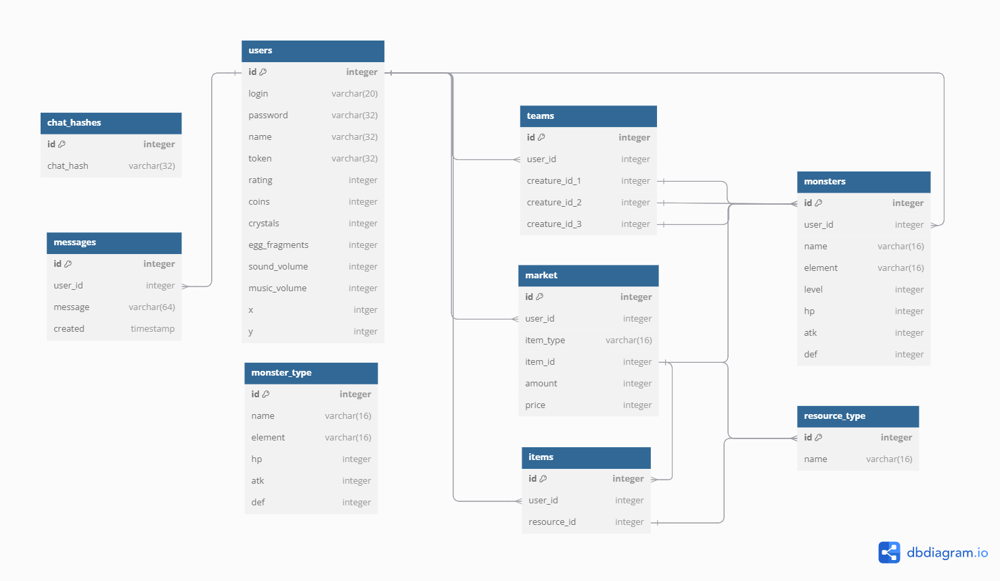

login: admin
pass: 111

как запустить:
в терминал по очереди
cd client
npm install (если ещё не установлено)
npm start

Также для того чтобы запустить сервер, надо иметь версию ospanel ниже 6, то есть желательно 5.4.3.

Для того чтобы запустить сервер, нужно папке проекта найти папку server, её нужно перенести в папку domains в корневой папке ospanel,
либо в настройках находим вкладку сервер и там настройку "корневая папка доменов" и в ней вставляем путь до вашего корневой папки вашего проекта.
После чего запускаем ospanel и в трее (галочка в нижней панели задач) открываем сам ospanel (зеленый флажок) и нажимаем кнопку запустить, также если ospanel не нестроен, то надо включить MySQL в настройках, во вкладке модули, у меня стоит версия 8.0 и версия php 8.1.

Также надо импортировать базу данных в ваш локальный сервак, для этого открываете ospanel, и во вкладке допольнительно будет приложение phpMyAdmin открываем его и заходим через логин - root и пустой пароль, и жмем кнопку импорт и выбираем файл monstaris.sql в корневой папке проекта.

готово, наш проект запущен вместе с серваком, фронтом и базой данных.

Если что, то рынок пока не работает с базой данных и он до сих пор работает от статики, чтобы с ним хоть как то можно было работать!
Потому что надо реализовать соответствующие методы в бекэнде и добавить таблицы и информацию в них в базе данных.

структура базы данных:

база данных будет изменятся и допольняться в будущем!

у нас есть следующие таблицы:
-users , в ней хранится основная информация о пользователе
-messages , хранит все сообщения в чате
-chat_hashes , хранит хэш чата, для оптимизации
-market , хранит информацию о выставленных лотах на рынок
-teams , хранит информацию об текущем отряде монстров пользователя
-items , общее хранилище всяких уникальных объектов, таких как например яйци призыва монстров
-monsters , таблица со всеми уникальными монстрами
-resource_type , все типы ресурсов, откуда будут браться примеры для рынка и для таблицы предметов
-monster_type , все типы начальных монстров, по примеру которых будут создаваться начальные монстры

Пока не хватает таблиц для хранения карты и не понятно, как реализовывать взаимодействие боевки на фронте с бэком.
Все несостыковки в базе данных и предложения по улучшению, писать сразу на доску.
